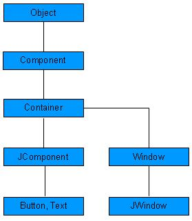

# 控件

每一个用户界面都需考虑如下三个主要方面：

- **UI 元素**：这是用户最终看到和与之交互的可视化元素。AWT 提供了丰富的常用元素，从基本的到复杂的，我们将在本教程中讲述。
- **布局**：布局定义了如何在屏幕上组织 UI 元素，并且为 GUI（Graphical User Interface）提供了最终的外观。该部分会在布局一章讲述。
- **行为**：这是用户和 UI 元素交互时发生的事件，该部分将在事件处理一章讲述。

每一个 Swing 控件都从下述 Component 类层次中继承了一些属性。

|    序号    |    类和描述    |
|:----------|:---------------|
|    1      |[Component](http://www.tutorialspoint.com/swing/swing_component.htm)|